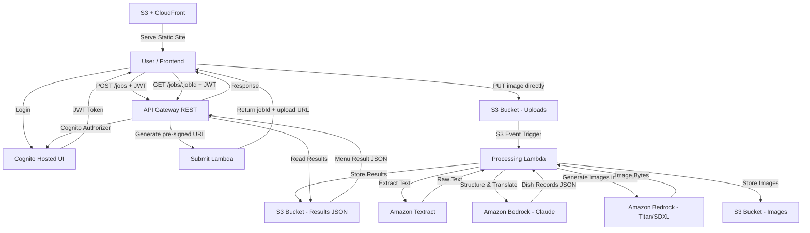

# Design Document: Menu Vision

## Overview

Menu Vision is a serverless web application that transforms restaurant menu photos into structured, translated, and visually enriched dish information. The system uses a pipeline architecture: a photo is uploaded, OCR extracts text, an LLM structures and translates the content, and an image generator creates photorealistic dish visuals. The frontend is a static site on S3/CloudFront, and all backend processing runs on AWS Lambda behind API Gateway.

### Key Design Decisions

- **Amazon Textract** for OCR: Native AWS service with strong multi-language support, pay-per-use pricing, and no infrastructure to manage. Preferred over Tesseract (requires packaging) or Google Vision (cross-cloud complexity).
- **Amazon Bedrock (Claude)** for LLM: Managed LLM access within AWS, no API key management for external services, pay-per-token pricing. Claude models excel at structured extraction and translation tasks.
- **Amazon Bedrock (Stability AI SDXL or Amazon Titan Image Generator)** for image generation: Stays within AWS ecosystem, serverless, pay-per-image. Titan Image Generator is the most cost-effective option within Bedrock.
- **Asynchronous processing with polling**: Lambda has a 15-minute max timeout. Image generation for many dishes can be slow. The frontend uploads, gets a job ID, and polls for results. This avoids API Gateway's 29-second timeout limit.
- **Parallel image generation**: Dish images are generated concurrently using a thread pool (5 workers) inside the Processing Lambda. Bedrock API calls are I/O-bound, so threading is effective. This reduces image generation time from ~100-200s to ~20-40s for a 20-dish menu.
- **Configurable image model**: The image generation model is configurable via environment variable. Default is Amazon Titan Image Generator v2 ($0.01/image, decent quality). Can switch to Stability AI SDXL ($0.04/image, better photorealism) without code changes.
- **Local-first development**: The core pipeline (OCR → LLM → Image Gen) is built as a standalone Python module that can run locally as a CLI tool. Lambda handlers are thin wrappers around this core. This enables fast iteration and testing with real menu images before deploying to AWS.
- **S3 for image storage with lifecycle policy**: Generated images are ephemeral — 30-day TTL keeps storage costs near zero.
- **Single Lambda function with step orchestration**: For a single-user app, a single Lambda that runs OCR → LLM → image gen sequentially is simpler and cheaper than Step Functions.
- **Cognito Hosted UI for authentication**: Amazon Cognito provides a pre-built login page. The user logs in on their phone, gets a JWT token, and the frontend attaches it to API requests. API Gateway validates tokens via a Cognito authorizer — no custom auth code needed. This replaces the API key approach with proper token-based auth.

## Architecture



### Request Flow

1. Frontend calls `POST /jobs` → API Gateway → Submit Lambda
2. Submit Lambda generates a jobId, creates a pre-signed S3 upload URL for the image, writes an initial job status (`processing`) to S3, and returns `{ jobId, uploadUrl }`
3. Frontend uploads the image directly to S3 using the pre-signed URL (bypasses API Gateway payload limits, cheaper, faster)
4. S3 event notification triggers the Processing Lambda automatically when the image lands
5. Processing Lambda runs the full pipeline:
   - Calls Textract for OCR
   - Sends extracted text to Bedrock Claude for structuring/translation
   - For each dish, calls Bedrock Titan Image Generator
   - Stores each generated image in S3
   - Writes final Menu_Result JSON to S3
6. Frontend polls `GET /jobs/{jobId}` until results are ready
7. Frontend fetches and displays the Menu_Result

### Why Direct S3 Upload?

- **Avoids API Gateway's 10MB payload limit** — REST API has a hard 10MB body limit, which is exactly the max image size allowed
- **Cheaper** — No API Gateway data transfer charges on the upload
- **Faster** — One fewer network hop (image goes straight to S3)
- **Simpler Lambda** — Submit Lambda only generates a pre-signed URL, no multipart parsing needed

## Components and Interfaces

### Frontend (Static Site)

- **Technology**: React single-page application (lightweight, static hosting), mobile-first responsive design
- **Hosting**: S3 bucket with CloudFront CDN
- **Auth**: Cognito Hosted UI integration via `amazon-cognito-identity-js` or AWS Amplify Auth library
- **Responsibilities**:
  - Redirect to Cognito login if no valid session
  - Camera capture / file upload interface (optimized for mobile/iPhone)
  - Image validation (format, size)
  - Request pre-signed URL from API Gateway
  - Upload image directly to S3
  - Poll for job completion
  - Render dish cards in responsive grid

### API Gateway

- **Type**: REST API
- **Authorizer**: Cognito User Pool authorizer — validates JWT tokens on all endpoints
- **Endpoints**:
  - `POST /jobs` — Creates a new processing job, returns `{ jobId: string, uploadUrl: string }`
  - `GET /jobs/{jobId}` — Returns job status and results when complete

### Cognito Authentication

- **User Pool**: Single user pool with one user account (the owner)
- **Hosted UI**: Cognito-provided login page — no custom login UI needed
- **Flow**:
  1. Frontend redirects to Cognito Hosted UI if no valid token
  2. User logs in with username/password
  3. Cognito returns JWT (ID token + access token)
  4. Frontend stores tokens and attaches access token to all API requests
  5. API Gateway Cognito authorizer validates the token — no Lambda code for auth
- **Token TTL**: 1 hour (default), refresh token 30 days
- **Domain**: Cognito provides a default domain (`https://<prefix>.auth.<region>.amazoncognito.com`)

### Processing Lambda

- **Runtime**: Python 3.12
- **Memory**: 1024 MB (sufficient for orchestration, not doing heavy compute locally)
- **Timeout**: 900 seconds (15 min max, needed for parallel image generation of large menus)
- **Invocation**: Triggered by S3 event when image is uploaded
- **Image generation**: Parallel via thread pool (10 workers default), configurable via `IMAGE_GEN_WORKERS` env var. Includes retry with exponential backoff for Bedrock throttling.
- **Image model**: Configurable via `IMAGE_MODEL_ID` env var (default: Titan Image Generator v2)

The architecture uses two Lambda functions:
1. **Submit Lambda**: Synchronous, generates a pre-signed S3 upload URL, writes initial job status, returns jobId + uploadUrl. Timeout: 30 seconds.
2. **Processing Lambda**: Triggered by S3 upload event, runs the full pipeline, writes results to S3. Timeout: 900 seconds.

### Submit Lambda Interface

```python
def handler(event, context) -> dict:
    """
    Creates a new job. Generates a pre-signed S3 upload URL for the image.
    Returns: { "jobId": "<uuid>", "uploadUrl": "<pre-signed S3 PUT URL>" }
    """
```

### Processing Lambda Interface

```python
def handler(event, context) -> None:
    """
    Triggered by S3 event when image is uploaded.
    Runs the full pipeline asynchronously.
    Event contains S3 bucket and key from the upload event.
    Writes MenuResult JSON to S3 when complete.
    """
```

### OCR Module Interface

```python
def extract_text(image_bytes: bytes) -> str:
    """
    Calls Amazon Textract to extract text from image bytes.
    Returns raw extracted text as a single string.
    Raises: OCRExtractionError if no text detected.
    """
```

### LLM Module Interface

```python
def structure_menu(raw_text: str) -> list[DishRecord]:
    """
    Sends raw OCR text to Bedrock Claude.
    Returns a list of structured DishRecord objects.
    Raises: LLMProcessingError on failure.
    """
```

### Image Generation Module Interface

```python
import os
from concurrent.futures import ThreadPoolExecutor, as_completed

IMAGE_MODEL_ID = os.environ.get("IMAGE_MODEL_ID", "amazon.titan-image-generator-v2:0")
MAX_WORKERS = int(os.environ.get("IMAGE_GEN_WORKERS", "10"))

def generate_dish_image(dish: DishRecord) -> bytes:
    """
    Generates a photorealistic image for a dish using Bedrock.
    Model is configurable via IMAGE_MODEL_ID env var.
    Returns image bytes (PNG).
    Raises: ImageGenerationError on failure.
    """

def generate_all_dish_images(dishes: list[DishRecord]) -> list[tuple[int, bytes | None]]:
    """
    Generates images for all dishes in parallel using a thread pool.
    Returns list of (dish_index, image_bytes_or_None) tuples.
    Failed dishes return None instead of raising.
    """
```

### Image Prompt Builder

```python
def build_image_prompt(dish: DishRecord) -> str:
    """
    Constructs an optimized prompt for the image generator.
    Combines dish name, description, and ingredients into a
    photorealistic food photography prompt.
    """
```

### Results Storage Interface

```python
def store_image(bucket: str, job_id: str, dish_index: int, image_bytes: bytes) -> str:
    """
    Stores a generated dish image in S3.
    Returns the public URL or pre-signed URL for the image.
    """

def store_results(bucket: str, job_id: str, menu_result: MenuResult) -> None:
    """
    Stores the final MenuResult JSON in S3.
    """

def get_results(bucket: str, job_id: str) -> MenuResult | None:
    """
    Retrieves MenuResult from S3. Returns None if not yet available.
    """
```

### Local CLI Interface

The core pipeline is runnable locally for development and testing:

```python
def run_pipeline(image_path: str) -> MenuResult:
    """
    Runs the full pipeline on a local image file.
    Calls AWS services (Textract, Bedrock) using local AWS credentials.
    Returns a MenuResult with dish images saved to a local output directory.
    """

# CLI usage: python -m menu_vision.pipeline --image menu.jpg --output ./results/
```

## Data Models

```python
from dataclasses import dataclass, field
from enum import Enum

class JobStatus(Enum):
    PROCESSING = "processing"
    COMPLETED = "completed"
    FAILED = "failed"
    PARTIAL = "partial"  # Some dishes failed but others succeeded

@dataclass
class DishRecord:
    original_name: str
    translated_name: str | None  # None if already English or unknown
    description: str | None       # None if unknown
    ingredients: list[str]        # Empty list if unknown
    price: str | None             # None if unknown, kept as string to preserve currency symbols
    image_url: str | None         # None until image generated, placeholder URL on failure

@dataclass
class MenuResult:
    job_id: str
    status: JobStatus
    source_language: str | None   # Detected language of the menu
    dishes: list[DishRecord] = field(default_factory=list)
    error_message: str | None = None

@dataclass
class ProcessingJob:
    job_id: str
    image_bucket: str
    image_key: str
```

### DishRecord JSON Schema

```json
{
  "original_name": "Boeuf Bourguignon",
  "translated_name": "Beef Burgundy",
  "description": "Slow-braised beef in red wine with carrots, onions, and mushrooms",
  "ingredients": ["beef", "red wine", "carrots", "onions", "mushrooms", "garlic", "thyme"],
  "price": "€24.50",
  "image_url": "https://bucket.s3.amazonaws.com/job123/dish_0.png"
}
```

### MenuResult JSON Schema

```json
{
  "job_id": "uuid-string",
  "status": "completed",
  "source_language": "French",
  "dishes": [ "...array of DishRecord..." ],
  "error_message": null
}
```


## Correctness Properties

*A property is a characteristic or behavior that should hold true across all valid executions of a system — essentially, a formal statement about what the system should do. Properties serve as the bridge between human-readable specifications and machine-verifiable correctness guarantees.*

### Property 1: File format validation accepts only supported types

*For any* file object, the validation function should return true if and only if the file's MIME type is one of `image/jpeg`, `image/png`, or `image/webp`, and the file size is at most 10 MB. All other files should be rejected with a descriptive error.

**Validates: Requirements 1.2, 1.3, 1.5**

### Property 2: Valid images trigger upload

*For any* file that passes format and size validation, the upload function should be invoked with the correct API endpoint and the file payload.

**Validates: Requirements 1.4**

### Property 3: LLM response parsing produces complete DishRecords

*For any* valid JSON string conforming to the expected LLM output schema, parsing should produce a list of DishRecord objects where each record has a non-empty `original_name` and all other fields are either populated with extracted values or explicitly set to None.

**Validates: Requirements 3.1, 3.2**

### Property 4: Unknown fields are None, not fabricated

*For any* LLM JSON response where a field is null or absent, the corresponding DishRecord field should be None (or empty list for ingredients), never a fabricated or default string value.

**Validates: Requirements 3.4**

### Property 5: DishRecord JSON round-trip

*For any* valid DishRecord object, serializing it to JSON and then deserializing the JSON back should produce an equivalent DishRecord object.

**Validates: Requirements 3.5**

### Property 6: Card rendering displays exactly non-null fields

*For any* DishRecord, the rendered card HTML should contain the text of every non-null field (original name, translated name, description, each ingredient, price) and should not contain placeholder labels or text for fields that are None.

**Validates: Requirements 5.1, 5.3**

### Property 7: Partial results on pipeline dish failure

*For any* list of DishRecords where image generation fails for a subset of dishes, the final MenuResult should contain all dishes, with successfully generated dishes having real image URLs and failed dishes having placeholder image URLs. No dishes should be dropped from the result.

**Validates: Requirements 7.1, 4.4**

### Property 8: Malformed requests produce 400 errors

*For any* request that is missing required fields or has an invalid content type, the request validation function should return a 400 status code with a descriptive error message.

**Validates: Requirements 7.4**

## Error Handling

### Cost Control and Security

This is a single-user application. The primary security goal is preventing unauthorized usage that could generate unexpected AWS costs.

#### Cost Estimates (per menu scan)

| Service | Cost per scan | Notes |
|---------|--------------|-------|
| Textract | ~$0.0015 | 1 page |
| Bedrock Claude | ~$0.01-0.05 | Depends on menu length |
| Bedrock Titan Image | ~$0.01 × N dishes | Largest cost driver |
| S3 | ~$0.00 | Negligible at this scale |
| Lambda | ~$0.00 | Free tier covers it |
| **Total (20-dish menu)** | **~$0.25-0.30** | |

#### Protections

1. **Cognito Authentication**: All API endpoints require a valid JWT token from Cognito. The Cognito User Pool has a single user account. Tokens expire after 1 hour, limiting the window if intercepted.

2. **AWS Budget Alarm**: Set a monthly budget of $10 with email notification at 80% and 100% thresholds. This is the ultimate safety net.

3. **Lambda Concurrency Limit**: Set reserved concurrency on the Processing Lambda to 1. This physically prevents more than one pipeline run at a time, capping throughput and cost.

4. **Pre-signed URL Constraints**:
   - TTL: 15 minutes
   - Max content length: 10MB (enforced in the pre-signed URL policy)
   - Restricted to `image/jpeg`, `image/png`, `image/webp` content types

5. **S3 Bucket Security**:
   - Block all public access on all buckets
   - Upload bucket: only accepts PUTs via pre-signed URLs
   - Image bucket: served through CloudFront with Origin Access Control (OAC)
   - Results bucket: accessed only by Lambda and the status endpoint

6. **CloudFront Origin Access Control**: Frontend S3 bucket is not publicly accessible — only CloudFront can read from it.

7. **CORS Configuration**: API Gateway CORS restricted to the CloudFront domain only.

8. **Throttling**: API Gateway throttling set to 10 requests/second burst, 5 requests/second sustained. More than enough for single-user, prevents abuse.

9. **Bedrock Throttle Retry**: Image generation includes retry with exponential backoff for Bedrock `ThrottlingException`, preventing failures when parallel workers exceed the account's concurrent request quota.

### Pipeline Error Strategy

The pipeline follows a "best effort, partial results" strategy:

| Error Source | Behavior | Result |
|---|---|---|
| Image upload fails | Return error immediately | 500 with message |
| Textract returns no text | Return error | `status: "failed"`, error message |
| Textract partial failure | Continue with extracted text | Normal processing |
| Bedrock Claude fails | Return error | `status: "failed"`, error message |
| Bedrock Claude returns malformed JSON | Retry once, then fail | `status: "failed"`, error message |
| Image generation fails for one dish | Use placeholder URL, continue | `status: "partial"`, all dishes present |
| Image generation fails for all dishes | Return dishes without images | `status: "partial"`, placeholder URLs |
| S3 storage fails | Return error | `status: "failed"`, error message |
| Lambda timeout approaching | Save partial results | `status: "partial"`, completed dishes |

### Error Response Format

```json
{
  "job_id": "uuid-string",
  "status": "failed",
  "source_language": null,
  "dishes": [],
  "error_message": "OCR extraction failed: no text detected in the uploaded image"
}
```

### Timeout Handling

The Processing Lambda monitors elapsed time. When 80% of the timeout (720 seconds) is reached, it:
1. Stops generating images for remaining dishes
2. Attaches placeholder URLs to unprocessed dishes
3. Writes partial results to S3 with `status: "partial"`

## Testing Strategy

### Unit Tests

Unit tests cover specific examples, edge cases, and error conditions:

- **File validation**: Test specific file types (JPEG accepted, PDF rejected, 11MB rejected)
- **DishRecord parsing**: Test with known LLM output samples (well-formed, malformed, partial)
- **Image prompt builder**: Test prompt construction with known dish data
- **Error handling**: Test each error path (OCR failure, LLM failure, image gen failure)
- **Results storage**: Test S3 key construction and URL generation
- **Request validation**: Test malformed request detection

### Property-Based Tests

Property-based tests verify universal properties across randomly generated inputs. Use `hypothesis` (Python) for backend and `fast-check` (JavaScript/TypeScript) for frontend.

**Configuration**: Minimum 100 iterations per property test.

Each property test must be tagged with a comment referencing the design property:

```python
# Feature: menu-vision, Property 5: DishRecord JSON round-trip
@given(st.builds(DishRecord, ...))
def test_dish_record_round_trip(dish):
    assert DishRecord.from_json(dish.to_json()) == dish
```

**Property tests to implement**:

1. **Property 1**: File format validation — generate random file metadata (MIME types, sizes), verify accept/reject matches the spec
2. **Property 2**: Valid image upload trigger — generate valid file metadata, verify upload is called
3. **Property 3**: LLM response parsing — generate random valid JSON conforming to schema, verify DishRecords are complete
4. **Property 4**: Unknown field handling — generate JSON with random null fields, verify DishRecord has None values
5. **Property 5**: DishRecord round-trip — generate random DishRecords, serialize/deserialize, verify equality
6. **Property 6**: Card rendering completeness — generate random DishRecords, render, verify all non-null fields present and no null fields shown
7. **Property 7**: Partial failure resilience — generate dish lists with random failures, verify all dishes present in result
8. **Property 8**: Malformed request validation — generate random invalid requests, verify 400 response

### Integration Tests

- End-to-end pipeline test with a sample menu image (mocked AWS services)
- API Gateway request/response cycle test
- S3 storage and retrieval test
